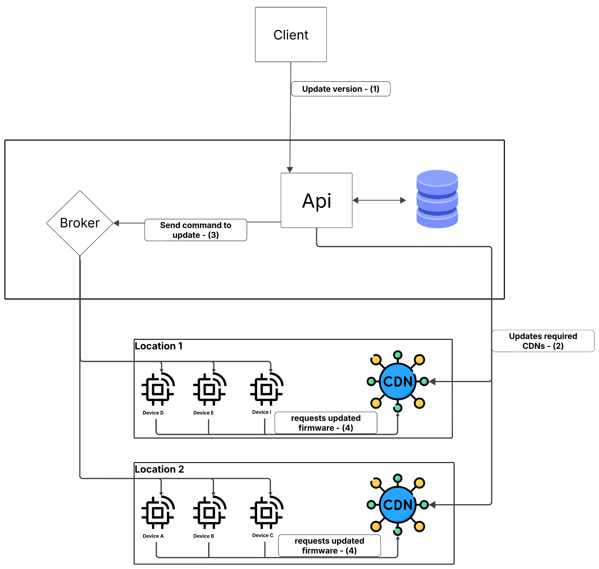

# 🚀 OpenIOT

An **open-source** system to update IoT devices in a **robust**, **secure**, and **simple** way.

---

## 📖 Table of Contents

- [Overview](#overview)
- [Features](#features)
- [Technologies Used](#technologies-used)
- [Proposed Architecture](#proposed-architecture)
- [License](#license)
- [Contact](#contact)

---

## Overview

**OpenIOT** is a project designed to simplify version management in IoT devices, ensuring a seamless process so that both large and small projects can manage their device firmware updates in a **robust** manner. The proposals include:

- **Controlled Deployments** using **Canary** and **Blue-Green** strategies.
- **Real-Time Monitoring** to track device updates.
- **Automatic Rollback** in case of issues, ensuring added security during updates.

---

## Features

In the **first version** of the project, you will find:

- **GitHub Integration:**  
  Automatically detects new firmware releases.
  
- **Different Deployment Strategies:**  
  Implementation of **Canary** and **Blue-Green** strategies to deploy updates securely and flexibly.
  
- **Real-Time Monitoring:**  
  Access the count of updated devices.
  
- **Automated Rollback:**  
  If the new version encounters issues, the system allows reverting to the previous version.

---

## Technologies Used

The **MVP** of the project uses the following technologies:

- **Language:** [Golang](https://golang.org/)
- **Database:** [MongoDB](https://www.mongodb.com/)
- **Messaging:** [RabbitMQ](https://www.rabbitmq.com/)

---

## Proposed Architecture

Below is an overview of the system architecture:

  
*(Insert here the image representing the system architecture.)*

---

## License

Distributed under the MIT License. See the [LICENSE](LICENSE) file for details.

---

## Contact

If you have any questions or would like to contribute, please get in touch:

- **Email:** [fernandocoelhosaraivanando@gmail.com](mailto:fernandocoelhosaraivanando@gmail.com)
- **GitHub:** [Fernando-hub527](https://github.com/Fernando-hub527)
